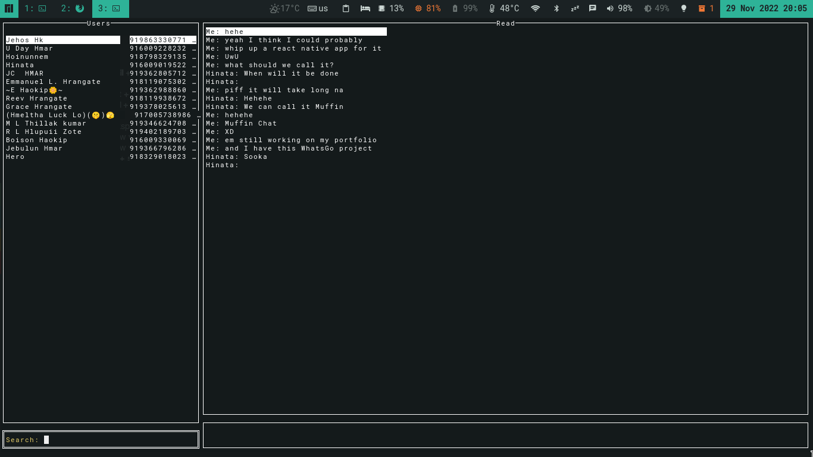

# WhatsGo
* A command line whatsapp client


### Requirements
* Golang
* A terminal

### Installation
#### Clone and run

```
git clone https://github.com/WinterSunset/WhatsGo
``` 

```
cd WhatsGo
```

```
go run .
```


#### Pre built binaries
* Not Available Yet

## Note
This is my FIRST golang project and I am basically bullshitting my way through. <br>
If there is anything I do, which can be done better, please submit an issue.
