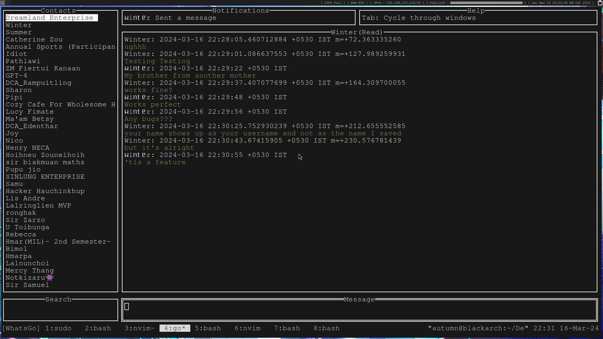

# WhatsGo
* A command line whatsapp client


### Requirements
* Golang
* A terminal

### Installation
#### Self build
```git clone https://github.com/WinterSunset/WhatsGo``` <br>
```cd WhatsGo``` <br>
```go run .``` <br>

#### Pre built binaries
* Not Available Yet

## Note
This is my FIRST golang project and I am basically bullshitting my way through. <br>
If there is anything I do, which can be done better, please submit an issue.
